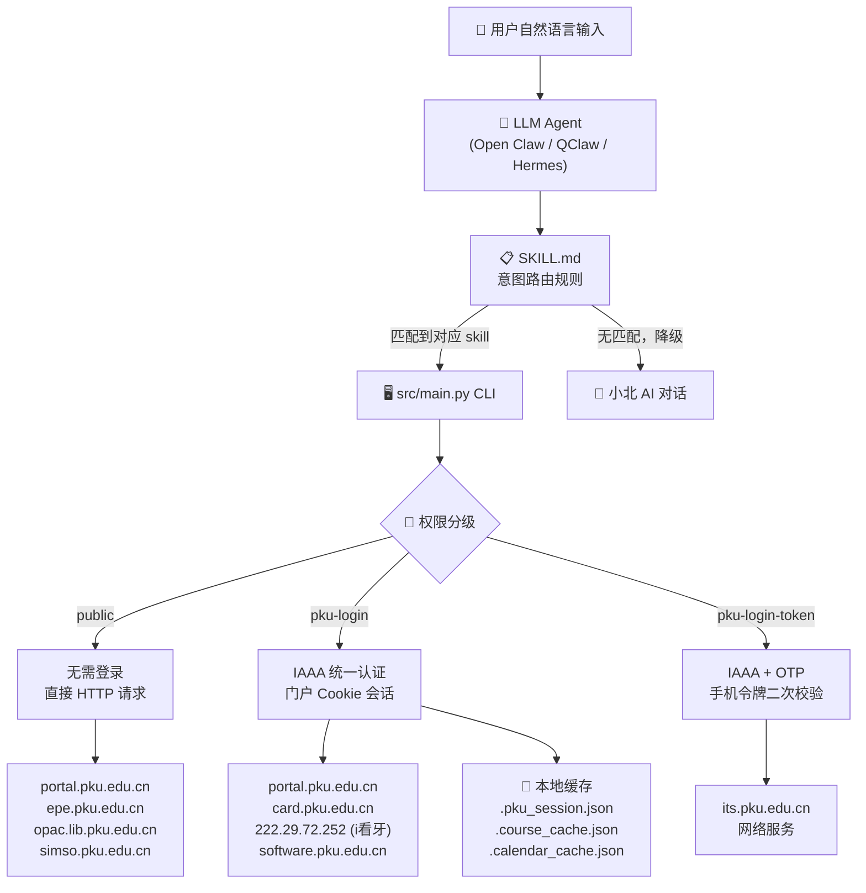
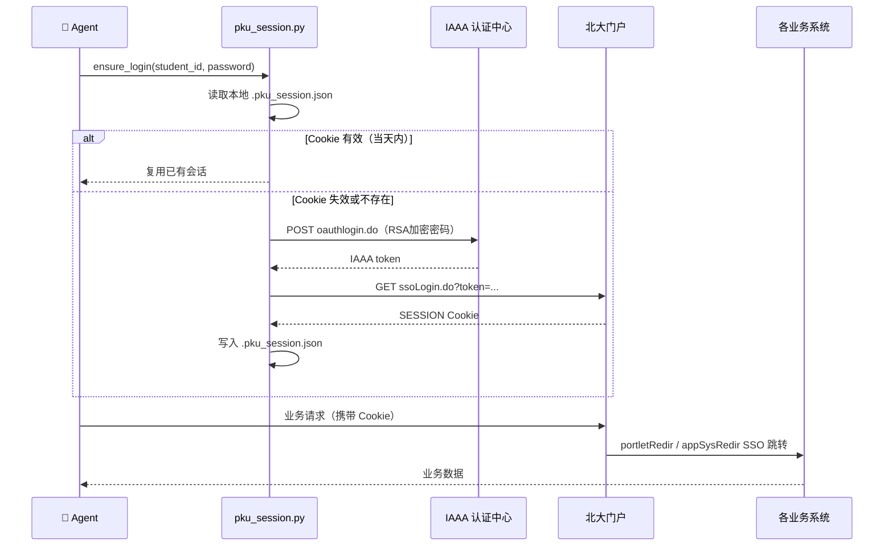
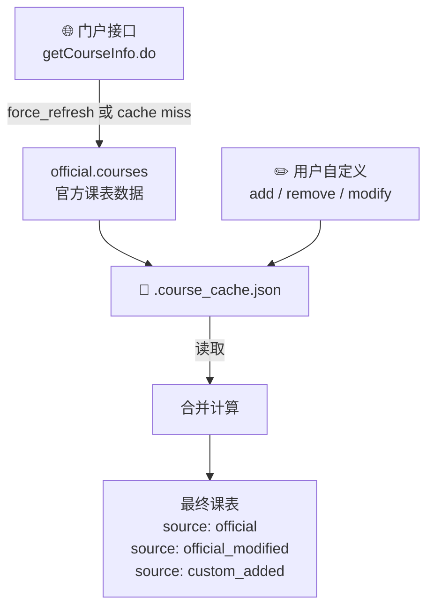
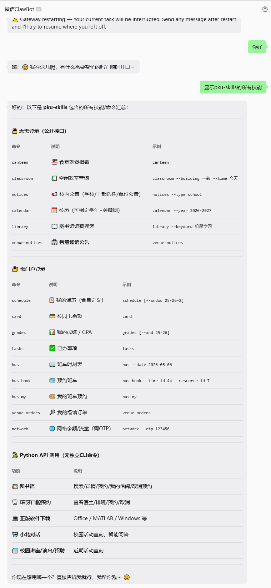
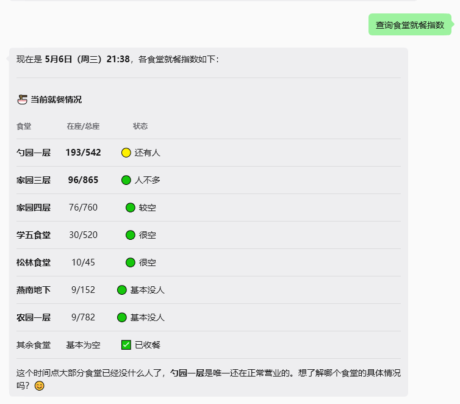
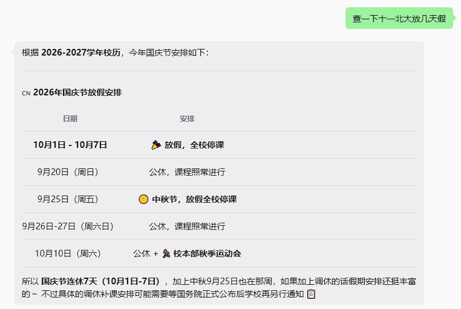
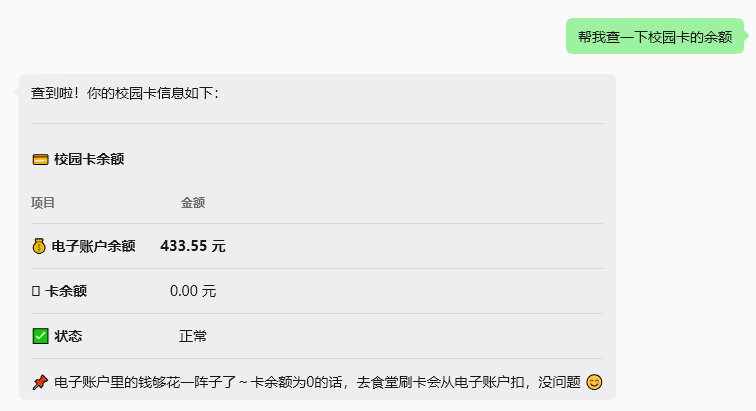
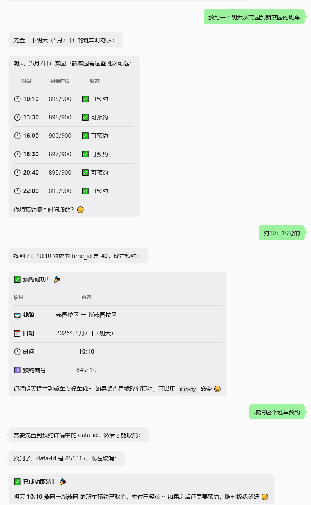
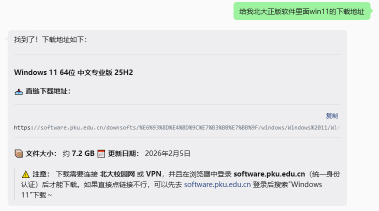

<div align="center">

# 🎓 PKU Skills — 北大校内服务技能库

### _"能跟 AI 说一句话搞定的事，为什么要打开北大门户各种页面？"_

[](LICENSE)
[](https://python.org)
[](https://agentskills.io)
[](https://github.com/zizhizhou/pku_skills)

[](https://github.com/zizhizhou/pku_skills)
[](https://github.com/zizhizhou/pku_skills)
[](https://github.com/zizhizhou/pku_skills)

<br>

<table>
<tr><td align="left">

🍜 &nbsp;食堂人多不多？哪个窗口不用排队？<br>
📚 &nbsp;图书馆有没有这本书？能不能借？在哪取？<br>
🚌 &nbsp;最早一班回昌平的车几点？帮我约上。<br>
🦷 &nbsp;i看牙想预约拔牙，哪个医生有空？<br>
💰 &nbsp;网费还剩多少？饭卡余额够不够吃到月底？

</td></tr>
</table>

### ✨ 这些，PKU Skills 都能一句话搞定。

<br>

将北大 17 项校内服务封装为标准化 Agent 技能库，覆盖门户、图书馆、场馆、班车、医疗、正版软件等全场景。

**自然语言输入 → Agent 调用 Skill → 直连北大接口 → 完整业务闭环**

Agent + PKU Skills = 你的北大生活助手,帮你去查询、去预约、去规划你在北大的生活点点滴滴，别让这些琐事消耗你的精力

<br>

[🏗️ 架构设计](#架构设计) · [⚡ 安装](#安装) · [🚀 使用](#使用) · [✨ 效果示例](#效果示例) · [📦 功能覆盖](#功能覆盖) · [🔒 凭据说明](#凭据说明)

</div>

---

## 功能覆盖

### 🔓 无需登录（public）

| Skill             | 功能                            |
| ----------------- | ------------------------------- |
| `canteen_index`   | 就餐指数（各食堂实时人流）      |
| `free_classroom`  | 空闲教室查询                    |
| `portal_notices`  | 校内公告（学校/干部/单位）      |
| `school_calendar` | 校历查询（PDF 解析 + 本地缓存） |
| `library_catalog` | 图书馆馆藏搜索、详情、预约      |
| `venue_notices`   | 智慧场馆通知公告                |

### 🔐 需门户登录（pku-login）

| Skill               | 功能                               |
| ------------------- | ---------------------------------- |
| `my_schedule`       | 我的课表（含自定义课程叠加层）     |
| `campus_card`       | 校园卡余额                         |
| `my_grades`         | 我的成绩                           |
| `completed_tasks`   | 已办事项查询                       |
| `bus_reservation`   | 新燕园班车查询 / 预约 / 取消       |
| `venue_orders`      | 智慧场馆我的订单                   |
| `dental_service`    | i看牙预约（查询 / 预约 / 取消）    |
| `software_download` | 正版软件下载链接提取               |
| `xiaobei_chat`      | 小北对话交互                       |
| `xiaobei_activity`  | 小北活动查询（讲座 / 演出 / 招聘） |

### 🔑 需门户登录 + 手机令牌（pku-login-token）

| Skill        | 功能                             |
| ------------ | -------------------------------- |
| `my_network` | 我的网络（网费余额、设备、套餐） |

---

## 架构设计

### 整体架构



### 认证链路



### 课表自定义叠加层



> `force_refresh` 只更新 official，自定义内容永不被覆盖。

---

## 安装

6202 年了，你有 Agent，让它帮你装——直接把下面这句话扔给它：

> 帮我从 `https://github.com/zizhizhou/pku_skills` 安装 PKU Skills

或者自己动手，三行搞定：

```bash
git clone https://github.com/zizhizhou/pku_skills ~/.openclaw/skills/pku_skills
pip install -r ~/.openclaw/skills/pku_skills/requirements.txt
cp ~/.openclaw/skills/pku_skills/.env.example ~/.openclaw/skills/pku_skills/.env
# 编辑 .env，填入学号和密码
```

不同 Agent 平台的详细安装步骤见 [INSTALL.md](INSTALL.md)。

---

## 🚀 使用

安装完成后，直接用你能想到的最直接、最不绕弯、最一针见血、最开门见山、最不铺垫（此处省略99个最xx）的方式说出你的需求，Agent会不躲，不藏，不绕，不逃，稳稳地接住你。以下是一些常用示例：

### 🔓 无需登录

| 你说                     | Agent 做的事                     |
| ------------------------ | -------------------------------- |
| 今天学一食堂人多吗       | 查询各食堂实时就餐人数           |
| 明天下午三教有没有空教室 | 按楼栋+时段筛选空闲教室          |
| 帮我查最新的校内公告     | 返回学校/干部/单位三类公告       |
| 五一放几天假             | 解析校历 PDF，匹配假期安排       |
| 帮我查《活着》能不能借   | 搜索馆藏，返回在库状态和取书地点 |

### 🔐 需登录

| 你说                               | Agent 做的事                        |
| ---------------------------------- | ----------------------------------- |
| 帮我看看我的课表                   | 查询本学期课表，标注官方/自定义来源 |
| 我的饭卡还剩多少钱                 | 查询电子账户余额和卡余额            |
| 帮我约明天从燕园到新燕园最早的班车 | 查时刻表 → 确认班次 → 完成预约      |
| 我的成绩出来了吗                   | 查询已出成绩列表，标注未出项        |
| 帮我下载 Office Win64              | 登录正版软件平台，提取直链          |
| 预约拔牙医生                       | 列出在诊医生 → 选择 → 预约时段      |
| 网费还剩多少                       | 需提供 OTP，查询余额和套餐          |

### 🛠️ 课表自定义

课表支持在官方数据基础上增删改，自定义内容本地保存，`force_refresh` 不会覆盖：

```
# 对 Agent 说：
帮我在课表里加一门课，周五第七节，B101教室，叫"自定义测试课"
把课表里 ID 为 xxx 的课删掉
把那门课的教室改成 理教 107
```

---

## ✨ 效果示例

### 查看所有技能



### 🍜 食堂人多不多？



### 📅 十一放几天？



### 💳 饭卡还剩多少钱？



### 🚌 帮我订一班车



Agent 自动查时刻表 → 确认班次 → 完成预约 → 支持取消，全程对话驱动。

### 💻 下个 Windows 用用



---

## 项目结构

```
pku_skills/
├── SKILL.md                  # Agent 入口：意图路由规则 + 命令速查
├── INSTALL.md                # 各平台详细安装指南
├── requirements.txt          # Python 依赖
├── .env.example              # 凭据配置模板
│
├── skills/                   # 技能描述（YAML）
│   ├── public/               # 无需登录（6 个）
│   ├── pku-login/            # 需门户登录（12 个）
│   └── pku-login-token/      # 需 OTP 双因子（1 个）
│
├── src/                      # Python 实现
│   ├── main.py               # CLI 入口
│   ├── pku_session.py        # IAAA 统一认证会话
│   ├── pku_portal.py         # 门户相关 API
│   ├── pku_public.py         # 无需登录的公开 API
│   └── pku_venue.py          # 智慧场馆 API
│
└── imges/                    # 效果示例截图
```

---

## 凭据说明

账号密码只写在你本机的 `.env` 文件里，**不经过任何第三方服务器**，所有请求直连北大接口。代码完全开源，逻辑透明可查。

- 登录态缓存于 `.pku_session.json`，同一天内免重复登录
- 课表自定义数据缓存于 `.course_cache.json`
- 校历缓存于 `.calendar_cache.json`
- OTP 有效期约 30 秒，仅网络服务时使用，不建议写入配置文件

以上缓存文件均已加入 `.gitignore`，不会被提交。

---

## Star History

[](https://star-history.com/#zizhizhou/pku_skills&Date)
