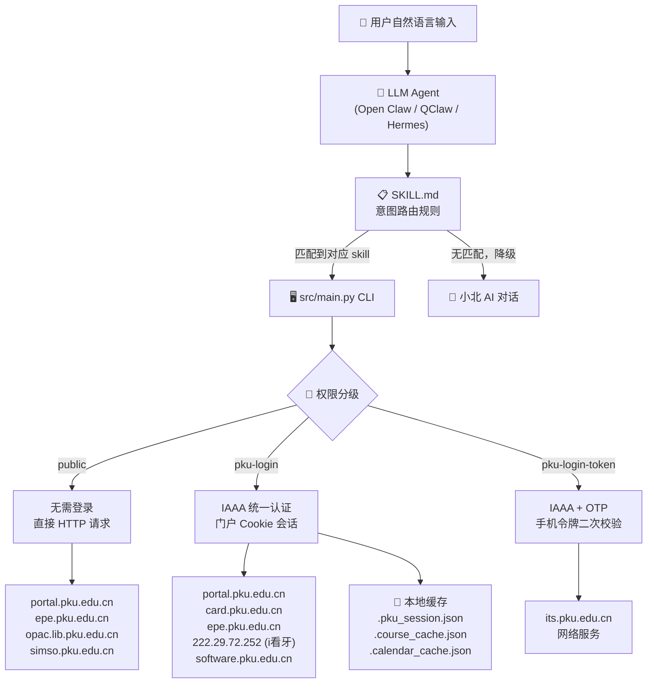
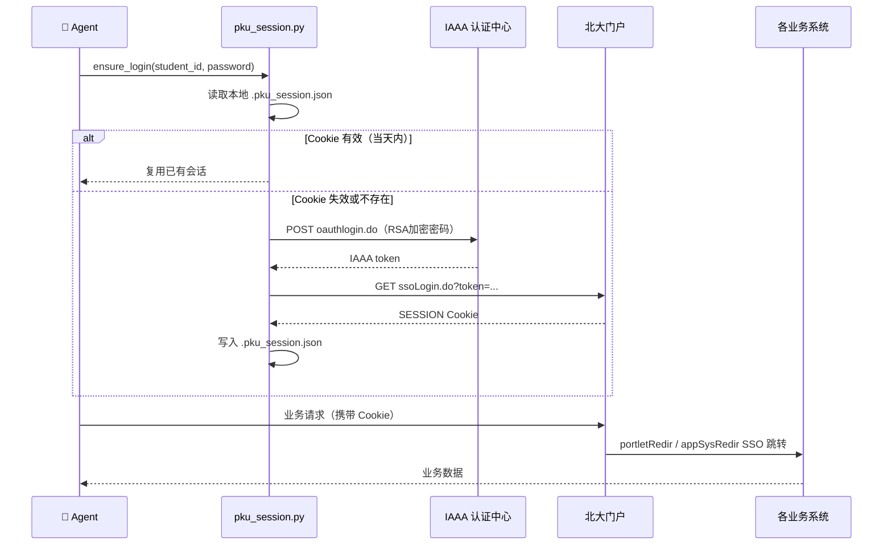
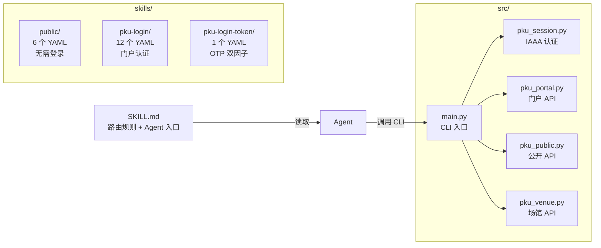
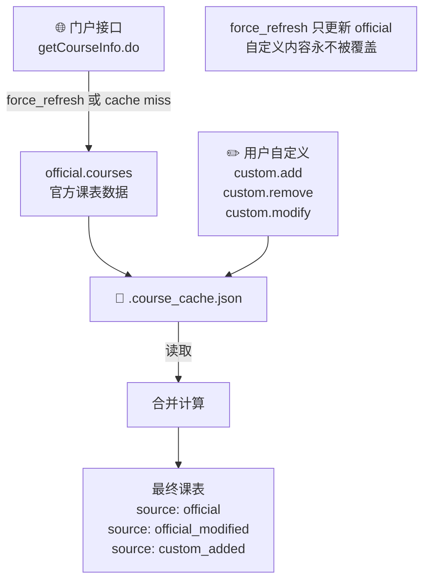

# PKU Skills — 北大校内服务技能库

基于北京大学统一身份认证体系，将17项校内业务系统封装为标准化技能库，供 LLM Agent（Open Claw、QClaw、Hermes 等）直接调用。用自然语言一句话完成查询、预约、取消等完整业务操作。

---

## 架构设计

### 整体架构



### 认证链路



### Skill 文件结构



### 课表自定义叠加层



---

## 功能覆盖

### 无需登录（public）

| Skill | 功能 |
|-------|------|
| `canteen_index` | 就餐指数（各食堂实时人流） |
| `free_classroom` | 空闲教室查询 |
| `portal_notices` | 校内公告（学校/干部/单位） |
| `school_calendar` | 校历查询（PDF 解析+本地缓存） |
| `library_catalog` | 图书馆馆藏搜索、详情、预约 |
| `venue_notices` | 智慧场馆通知公告 |

### 需门户登录（pku-login）

| Skill | 功能 |
|-------|------|
| `my_schedule` | 我的课表（含自定义课程叠加层） |
| `campus_card` | 校园卡余额 |
| `my_grades` | 我的成绩 |
| `completed_tasks` | 已办事项查询 |
| `bus_reservation` | 新燕园班车查询/预约/取消 |
| `venue_orders` | 智慧场馆我的订单 |
| `dental_service` | i看牙预约（查询/预约/取消） |
| `software_download` | 正版软件下载链接提取 |
| `xiaobei_chat` | 小北对话交互 |
| `xiaobei_activity` | 小北活动查询（讲座/演出/招聘） |

### 需门户登录 + 手机令牌（pku-login-token）

| Skill | 功能 |
|-------|------|
| `my_network` | 我的网络（网费余额、设备、套餐） |

---

## 使用演示

### 查看所有技能


### 查询食堂就餐指数

> "查询食堂就餐指数"


实时返回各食堂在座人数与状态，帮你选一个人少的地方吃饭。

---

### 查询校历假期安排

> "查一下十一北大放几天假"


校历本地缓存，秒级响应，支持关键词检索任意假期。

---

### 查询校园卡余额

> "帮我查一下校园卡的余额"


登录后直接返回电子账户余额与卡余额。

---

### 班车查询 + 预约 + 取消

> "预约一下明天从燕园到新燕园的班车"


Agent 自动查询次日时刻表 → 确认班次 → 完成预约 → 支持一键取消，全程对话驱动。

---

### 正版软件下载链接

> "给我北大正版软件里面 win11 的下载地址"


自动登录正版软件平台，提取直链下载地址。

---

## 在 Agent 中安装

### Open Claw

**方式一：克隆到 skills 目录（推荐）**

```bash
git clone https://github.com/zizhizhou/pku_skills ~/.openclaw/skills/pku_skills
```

**方式二：克隆到当前工作区**

```bash
git clone https://github.com/zizhizhou/pku_skills <workspace>/skills/pku_skills
```

安装完成后，在 Open Claw 中配置凭据（见下方「凭据说明」），重启 Agent 即可使用。

---

### QClaw

QClaw 与 Open Claw 共享 skill 目录格式，安装方式相同：

```bash
git clone https://github.com/zizhizhou/pku_skills ~/.openclaw/skills/pku_skills
```

或通过 QClaw Dashboard（`http://localhost:3000`）的 Skills 页面手动加载本地目录。

---

### Hermes Agent

**必须通过 git clone 安装完整仓库**（仅下载 SKILL.md 会缺少 `src/` 运行目录）：

```bash
git clone https://github.com/zizhizhou/pku_skills ~/.hermes/skills/pku_skills
```

安装依赖：

```bash
pip install -r ~/.hermes/skills/pku_skills/requirements.txt
```

Hermes 读取 SKILL.md 中的 `required_environment_variables`，会在首次调用时提示你输入 `PKU_STUDENT_ID` 和 `PKU_PASSWORD`，凭据仅存本地，不经过任何服务器。

技能中所有命令通过 `${HERMES_SKILL_DIR}` 变量引用安装目录，**无需手动配置路径**，在 macOS / Linux / Windows 上均可直接使用。

**方式二：配置外部 skills 目录**

在 `~/.hermes/config.yaml` 中添加：

```yaml
skills:
  external_dirs:
    - ~/path/to/pku_skills
```

---

> 三个平台均通过仓库根目录的 `SKILL.md` 加载技能。需要登录的功能请确保已设置 `PKU_STUDENT_ID` 和 `PKU_PASSWORD` 环境变量或 `.env` 文件。

---

## 快速上手

### 安装依赖

```bash
pip install -r requirements.txt
```

### 配置凭据

```bash
cp .env.example .env
# 编辑 .env，填入 PKU_STUDENT_ID 和 PKU_PASSWORD
```

### 运行命令

```bash
# 无需登录
python src/main.py canteen
python src/main.py classroom --building 三教
python src/main.py notices --type school
python src/main.py calendar --keyword 五一
python src/main.py library --keyword 机器学习

# 需登录
python src/main.py card
python src/main.py grades
python src/main.py schedule
python src/main.py bus --date 2026-05-06
python src/main.py tasks

# 需登录+OTP
python src/main.py network --otp 123456
```

完整命令列表见 [SKILL.md](SKILL.md)。

---

## 目录结构

```
skills/
├── public/          # 无需登录的技能 YAML
├── pku-login/       # 需门户登录的技能 YAML
└── pku-login-token/ # 需双重认证的技能 YAML
src/
├── main.py          # CLI 入口
├── pku_session.py   # IAAA 统一认证会话
├── pku_portal.py    # 门户相关 API
├── pku_public.py    # 无需登录的公开 API
└── pku_venue.py     # 智慧场馆 API
imges/               # 使用演示截图
```

---

## 凭据说明

- 账号密码仅写在本机 `.env` 文件，**不经过任何第三方服务器**，所有请求直连北大接口
- 登录态缓存于 `.pku_session.json`（已加入 `.gitignore`，同一天内免重复登录）
- 课表自定义数据缓存于 `.course_cache.json`（已加入 `.gitignore`）
- 校历缓存于 `.calendar_cache.json`（已加入 `.gitignore`）
- OTP（手机令牌）有效期约 30 秒，仅需网络服务时使用，不建议写入配置文件
- 代码完全开源，逻辑透明可查
